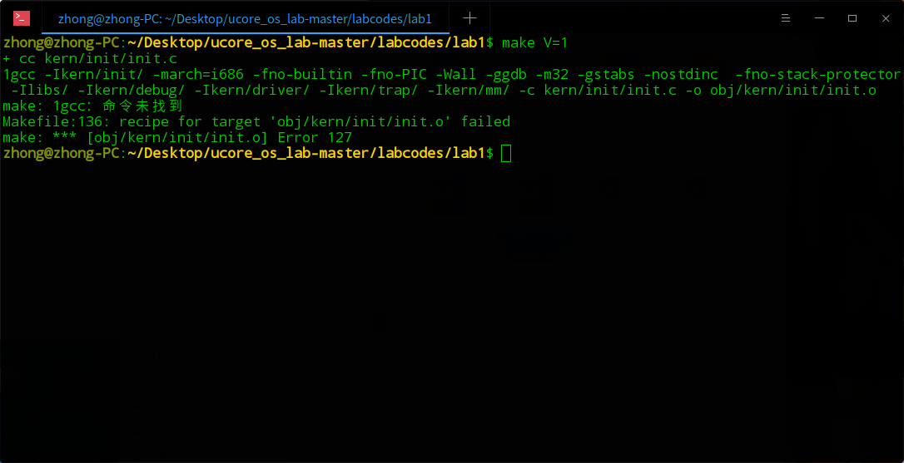
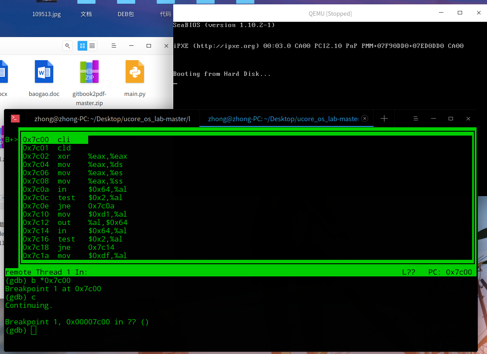

# UcoreOS 实验 Lab1报告

> 钟将 4042017044

## 练习1：理解通过make生成执行文件的过程

### 1.ucore.img的生成步骤

这里我们用命令"make V=1"来查看makefile执行的所有命令：


从这里我们可以看出来，ucore.img的生成分为以下三步：

- 第一步：编译操作系统内核源代码kern/*以及公共库libs/*，然后链接是生成二进制内核；

- 第二步：编译bootloader源代码boot/*，链接生成二进制bootloader；

- 第三步：使用零值初始化磁盘，然后将bootloader写入第一个扇区（主引导扇区），再将内核写入从第二扇区开始的位置。

### 2.一个被系统认为是符合规范的硬盘主引导扇区的特征

这里引出硬盘主引导扇区的几个重要特征：

- 1.硬盘主引导程序，位于该扇区的0－1BDH处

- 2.硬盘分区表，位于1BEH－1FDH处，每个分区表占用16个字节，共4个分区表，16个字节各字节意义如下：

>0:自举标志,80H为可引导分区,00为不可引导分区;

>1～3:本分区在硬盘上的开始物理地址；

> 4:分区类型，其中1表示为12位FAT表的基本DOS分区；4为16位FAT表的基本DOS分区；5为扩展DOS 分区；6为大于32M的DOS分区；其它为非DOS分区。

>5～7:本分区的结束地址； 8～11:该分区之前的扇区数，即此分区第一扇区的绝对扇区号； 12～15:该分区占用的总扇区数。

- 3．引导扇区的有效标志,位于1FEH－1FFH处,固定值为AA55H。

## 练习2：使用qemu执行并调试lab1中的软件

>注：这里我安装Qemu后，执行qemu命令得到提示bash找不到命令，操作系统是Deepin15.11物理机。谷歌后得知需要建立软连接 sudo ln -s /usr/bin/qemu-system-i386 /usr/bin/qemu，实际上运行的是qemu-system-i386或qemu-system-x86_64指令

输入命令

```bash
qemu -S -s -hda ./bin/ucore.img -monitor stdio
```
然后启动gdb后，开启远程调试并且显示汇编代码：

```bash
(gdb)  target remote 127.0.0.1:1234
(gdb)  layout asm
```

在初始化位置0x7c00设置实地址断点,测试断点正常。

接着设置断点并且继续执行：

```bash
(gdb)  b *0x7c00
(gdb)  c
```



断点设置成功，并且bootloader在断点处停了下来。

## 练习3：分析bootloader进入保护模式的过程

#### 第一步：屏蔽中断

切换的时候当然不希望中断发生，需要使用`cli`来屏蔽中断。

#### 第二步：开启A20

Intel早期的8086 CPU提供了20根地址线，寻址范围就是1MB，但是8086字长为16位，直接使用一个字来表示地址就不够了，所以使用段+偏移地址的方式进行寻址。段+偏移地址的最大寻址范围就是0xFFFF0+0xFFFF=0x10FFEF，这个范围大于1MB，所以如果程序访问了大于1MB的地址空间，就会发生回卷。然而随后的CPU的地址线越来越多，同时为了保证软件的兼容性，A20在实模式下被禁止（永远为0），这样就可以正常回卷了。但是在保护模式下，我们希望能够正常访问所以的内存，就必须将A20开启。

#### 第三步：加载段表GDT

在保护模式下，CPU采用分段存储管理机制，初始情况下，GDT中只有内核代码段和内核数据段，这两个段在内存上的空间是相同的，只是段的权限不同。

#### 第四步：设置cr0上的保护位

crX寄存器是Intel x86处理器上用于控制处理器行为的寄存器，cr0的第0位用来设置CPU是否开启保护模式[[Wikipedia](https://en.wikipedia.org/wiki/Control_register)]。

#### 第五步：调转到保护模式代码

在本项目中，当控制掉转到保护模式代码之后，bootloader进行段寄存器的初始化后调用bootmain函数，进行内核加载过程。

## 练习4：分析bootloader加载ELF格式的OS的过程

#### 1：bootloader如何读取扇区？

读取扇区实际上就是这样一个过程:

`等待磁盘准备好->发出读取扇区的命令->等待磁盘准备好->把磁盘扇区数据读到指定内存`

根据问题1对于硬盘主引导扇区特征的描述，而所有所有的IO操作是通过CPU访问硬盘的IO地址寄存器完成

贴上文件中的代码：

```cpp
static void readsect(void *dst, uint32_t secno) {
    // wait for disk to be ready
    waitdisk();

    outb(0x1F2, 1);                         // count = 1
    outb(0x1F3, secno & 0xFF);
    outb(0x1F4, (secno >> 8) & 0xFF);
    outb(0x1F5, (secno >> 16) & 0xFF);
    outb(0x1F6, ((secno >> 24) & 0xF) | 0xE0);
    outb(0x1F7, 0x20);                      // cmd 0x20 - read sectors

    // wait for disk to be ready
    waitdisk();

    // read a sector
    insl(0x1F0, dst, SECTSIZE / 4);
}
```

首先是`waitdisk()`函数实现的等待硬盘空闲，待硬盘空闲后，发送读取扇区的命令，对于指令字：`0x20`并且放在寄存器`0x1F7`中，读取的扇区数为1，放在寄存器`0x1F2`中。读取的扇区起始编号共28位，分成4部分依次放在寄存器`0x1F3`~`0x1F6`中。发出命令后，再次等待硬盘空闲。硬盘再次空闲后，开始从0x1F0寄存器中读数据。

#### 2.bootloader如何加载ELF格式的OS

贴代码。。。

```cpp
void bootmain(void) {
    // read the 1st page off disk
    readseg((uintptr_t)ELFHDR, SECTSIZE * 8, 0);

    // is this a valid ELF?
    if (ELFHDR->e_magic != ELF_MAGIC) {
        goto bad;
    }

    struct proghdr *ph, *eph;

    // load each program segment (ignores ph flags)
    ph = (struct proghdr *)((uintptr_t)ELFHDR + ELFHDR->e_phoff);
    eph = ph + ELFHDR->e_phnum;
    for (; ph < eph; ph ++) {
        readseg(ph->p_va & 0xFFFFFF, ph->p_memsz, ph->p_offset);
    }

    // call the entry point from the ELF header
    // note: does not return
    ((void (*)(void))(ELFHDR->e_entry & 0xFFFFFF))();
}
```

分析步骤是这样的：首先从硬盘中将`bin/kernel`文件的第一页内容加载到内存地址为`0x10000`的位置，目的是读取`kernel`文件的ELF Header信息。校验ELF Header的`e_magic`字段，以确保这是一个ELF文件。随后读取ELF Header的`e_phoff`字段，得到Program Header表的起始地址；而后读取ELF Header的`e_phnum`字段，得到`Program Header`表的元素数目。遍历Program Header表中的每个元素，得到每个Segment在文件中的偏移、要加载到内存中的位置（虚拟地址）及Segment的长度等信息，并通过磁盘I/O进行加载。加载完毕后，通过ELF Header的`e_entry`得到内核的入口地址，并跳转到该地址开始执行内核代码

## 练习5：实现函数调用堆栈跟踪函数

#### 1. 在lab1中完成kdebug.c中函数print_stackframe的实现，可以通过函数print_stackframe来跟踪函数调用堆栈中记录的返回地址。

根据2.3.3.1中关于函数栈的描述，将栈中有意义的数据读取出来即可。

```cpp
void print_stackframe(void) {
    uint32_t ebp = read_ebp();
    uint32_t eip = read_eip();
    for (int i = 0; i < STACKFRAME_DEPTH; i++) {
        cprintf("ebp:0x%08x eip:0x%08x args:", ebp, eip);
        for (int j = 0; j < 4; j++)
            cprintf("0x%08x ", ((((uint32_t *)ebp)+2))[j]);
        cprintf("\n");
        print_debuginfo(eip-1);
        eip = *(((uint32_t *)ebp)+1);
        ebp = *((uint32_t *)ebp);
    }
}
```

## 练习6：完善中断初始化和处理

#### 1. 中断描述符表（也可简称为保护模式下的中断向量表）中一个表项占多少字节？其中哪几位代表中断处理代码的入口？

终端描述符的结构体定义在mmu.h中：

```cpp
/* Gate descriptors for interrupts and traps */
struct gatedesc {
    unsigned gd_off_15_0 : 16;        // low 16 bits of offset in segment
    unsigned gd_ss : 16;            // segment selector
    unsigned gd_args : 5;            // # args, 0 for interrupt/trap gates
    unsigned gd_rsv1 : 3;            // reserved(should be zero I guess)
    unsigned gd_type : 4;            // type(STS_{TG,IG32,TG32})
    unsigned gd_s : 1;                // must be 0 (system)
    unsigned gd_dpl : 2;            // descriptor(meaning new) privilege level
    unsigned gd_p : 1;                // Present
    unsigned gd_off_31_16 : 16;        // high bits of offset in segment
};
```

显然占用64位，也就是8字节，中断处理代码的入口由offset和ss指定。

#### 2. 编程完善kern/trap/trap.c中对中断向量表进行初始化的函数idt_init。

除了系统调用中断(T_SYSCALL)使用陷阱门描述符且权限为用户态权限以外，其它中断均使用特权级(DPL)为０的中断门描述符，权限为内核态权限。所以，系统调用中断(T_SYSCALL)的初始化方法就略有不同。

```cpp
void idt_init(void) {
    extern uintptr_t __vectors[];
    for (int i = 0; i < sizeof(idt) / sizeof(struct gatedesc); i++)
        SETGATE(idt[i], 0, GD_KTEXT, __vectors[i], DPL_KERNEL);
    SETGATE(id[T_SYSCALL], 1, GD_KTEXT, __vectors[T_SYSCALL], DPL_USER);
    lidt(&idt_pd);
}
```

#### 3. 编程完善trap.c中的中断处理函数trap，在对时钟中断进行处理的部分填写trap函数中处理时钟中断的部分，使操作系统每遇到100次时钟中断后，调用print_ticks子程序，向屏幕上打印一行文字”100 ticks”。

```cpp
...
static int tick_count = 0;
...
static void trap_dispatch(struct trapframe *tf) {
	...
	    tick_count++;
	    if (tick_count == TICK_NUM) {
	        tick_count -= TICK_NUM;
	        print_ticks();
	    }
	    break;
	...
}
```

## 实验体会与心得

这次实验是第一次Ucore实验，总的来说还是有一定难度，主要是因为第一次上手，而且对于汇编、C语言掌握确实不够。现在看来不论是学习操作系统、计组，还是玩PWN、恶意代码、漏洞分析之类的安全，对于底层的知识还是必须要扎实掌握的。

本次实验还需要感谢与张璇同志的交流与合作。


